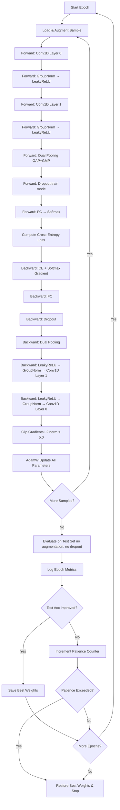
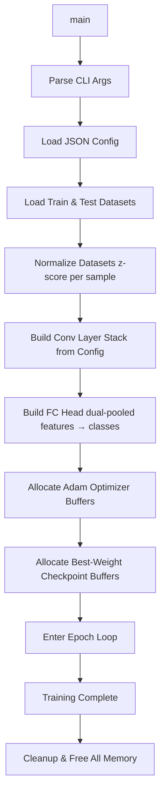

# PiLot Centralized

**Single-device CNN training and inference for time-series classification on nRF52840**

PiLot Centralized is the baseline implementation of the PiLot (Pipeline Lightweight on-device Training) framework. It runs the entire CNN—forward pass, loss computation, backpropagation, and weight updates—sequentially within a single process, simulating one nRF52840 microcontroller.

---

## Table of Contents

- [Overview](#overview)
- [Architecture](#architecture)
- [CNN Model](#cnn-model)
- [Control Flow](#control-flow)
- [Project Structure](#project-structure)
- [Building](#building)
- [Running](#running)
- [Configuration](#configuration)
- [Training Features](#training-features)
- [Supported Datasets](#supported-datasets)

---

## Overview

| Property | Value |
|---|---|
| **Target Hardware** | Nordic nRF52840 (ARM Cortex-M4F @ 64 MHz) |
| **RAM** | 256 KB (weights, activations, gradients) |
| **Flash** | 1 MB (dataset storage) |
| **Language** | C11 |
| **Build System** | CMake 3.20+ |
| **Dependencies** | `libm`, `pthread` |

The centralized version serves as a **reference implementation** for validating the distributed pipeline. It uses standard `malloc` for all allocations (no memory tracking) and processes each training sample end-to-end before moving to the next.

---

## Architecture

The system processes univariate time-series through a lightweight 1D-CNN with the following pipeline:

```
┌─────────────────────────────────────────────────────────────────┐
│                     Single nRF52840 Device                      │
│                                                                 │
│  Input(1×300) → Conv1D → GroupNorm → LeakyReLU                 │
│              → Conv1D → GroupNorm → LeakyReLU                   │
│              → DualPool(GAP+GMP)                                │
│              → Dropout → FC → Softmax → CrossEntropy            │
└─────────────────────────────────────────────────────────────────┘
```

---

## CNN Model

### Layer Details

| Layer | Type | Config | Input Shape | Output Shape | Parameters |
|---|---|---|---|---|---|
| 0 | Conv1D | 1→32, k=5, s=1, p=2 | 1×300 | 32×300 | 192 (160 weights + 32 bias) |
| — | GroupNorm | 8 groups | 32×300 | 32×300 | 0 |
| — | LeakyReLU | α=0.01 | 32×300 | 32×300 | 0 |
| 1 | Conv1D | 32→48, k=5, s=2, p=2 | 32×300 | 48×150 | 7,728 (7,680 weights + 48 bias) |
| — | GroupNorm | 8 groups | 48×150 | 48×150 | 0 |
| — | LeakyReLU | α=0.01 | 48×150 | 48×150 | 0 |
| 2 | DualPool | GAP + GMP | 48×150 | 96×1 | 0 |
| 3 | Dropout | rate=0.2 | 96×1 | 96×1 | 0 |
| 4 | FC | 96→12 | 96×1 | 12×1 | 1,164 (1,152 weights + 12 bias) |
| 5 | Softmax | — | 12×1 | 12×1 | 0 |

**Total trainable parameters: 9,084**

### Weight Initialization

- **Conv1D**: Kaiming (He) initialization — `scale = sqrt(2 / (in_channels × kernel_size))`
- **FC**: Xavier/Glorot initialization — `scale = sqrt(2 / (in_features + out_features))`

---

## Control Flow

### Training Epoch Flow



### Program Startup Flow



---

## Project Structure

```
PiLot_Centralized/
├── CMakeLists.txt              # Build configuration
├── configs/
│   └── model_config.json       # Generated model configuration
├── include/
│   ├── nn_types.h              # Tensor, Conv1D, FC, activation, optimizer declarations
│   ├── config_types.h          # Model config structs and loader API
│   └── logging.h               # Log macros (info, error, debug)
├── src/
│   ├── main.c                  # Entry point, training loop, evaluation
│   ├── augmentation.c          # Data augmentation (jitter, scaling, warp, shift)
│   ├── logging.c               # Logging implementation
│   ├── config/
│   │   └── config_loader.c     # JSON config parser
│   ├── data/
│   │   ├── ucr_loader.c        # UCR dataset loader (CSV, z-normalize, shuffle)
│   │   └── tensor.c            # Tensor create/free/copy utilities
│   └── nn/
│       ├── conv1d.c            # Conv1D forward & backward + GroupNorm
│       ├── fully_connected.c   # FC forward & backward
│       ├── activations.c       # LeakyReLU, Softmax, Dropout, Cross-Entropy
│       ├── pooling.c           # Dual Pooling (GAP+GMP) forward & backward
│       └── optimizers.c        # AdamW, Cosine Annealing LR, Gradient Clipping
└── build/                      # CMake build output
    └── pilot_centralized       # Compiled binary
```

---

## Building

### Prerequisites

- GCC with C11 support
- CMake ≥ 3.20

### Build Commands

```bash
cd PiLot_Centralized
mkdir -p build && cd build
cmake .. -DCMAKE_BUILD_TYPE=Release
make -j$(nproc)
```

The output binary is `build/pilot_centralized`.

---

## Running

### Basic Usage

```bash
./build/pilot_centralized --config=configs/model_config.json
```

### Full Options

```bash
./build/pilot_centralized \
    --config=configs/model_config.json \
    --dataset=Cricket_X \
    --epochs=50 \
    --debug
```

| Flag | Description | Default |
|---|---|---|
| `--config=<path>` | Path to JSON config file | **(required)** |
| `--dataset=<name>` | UCR dataset name (overrides config) | From config |
| `--epochs=<N>` | Number of training epochs (overrides config) | From config |
| `--debug` | Enable verbose debug logging | Disabled |

### Environment Variable

| Variable | Description | Default |
|---|---|---|
| `UCR_DATA_ROOT` | Root directory of UCR datasets | `/mnt/d/New folder/UCR_DATASETS` |

The loader expects the UCR archive structure: `$UCR_DATA_ROOT/<Dataset>/<Dataset>_TRAIN` and `$UCR_DATA_ROOT/<Dataset>/<Dataset>_TEST`.

---

## Configuration

The config file (`configs/model_config.json`) is generated by the shared `generate_config.py` script at the project root:

```bash
cd PiLot/
python3 generate_config.py --dataset=Cricket_X --epochs=50
```

### Config Structure

```json
{
  "model": { "name": "nRF52840_UniformCNN_Cricket_X", "version": "2.0" },
  "global": {
    "dataset": "Cricket_X",
    "epochs": 50,
    "num_classes": 12,
    "input_length": 300,
    "memory_limit_bytes": 0,
    "flash_memory_bytes": 0,
    "learning_rate": 0.01
  },
  "layers": [
    { "id": 0, "type": "conv1d", "in_channels": 1, "out_channels": 32, ... },
    { "id": 1, "type": "conv1d", "in_channels": 32, "out_channels": 48, ... },
    { "id": 2, "type": "fc", "in_features": 96, "out_features": 12, ... }
  ]
}
```

For the centralized build, `memory_limit_bytes` and `flash_memory_bytes` are set to 0 (no constraints enforced).

---

## Training Features

### Optimizer: AdamW

- **β₁** = 0.9, **β₂** = 0.999, **ε** = 1e-8
- **Weight decay** = 0.0003 (decoupled, true AdamW)
- Bias parameters are updated **without** weight decay

### Learning Rate Schedule: Cosine Annealing with Warm Restarts

- **Warmup**: Linear warmup from `η_min` to `base_lr` over 3 epochs
- **Cosine**: `η = η_min + 0.5 × (η_base − η_min) × (1 + cos(π × t / T_max))`
- **T_max** = 60 epochs, **η_min** = 1e-5

### Gradient Clipping

- L2-norm clipping with `max_norm = 5.0`
- Applied per-parameter-group (each conv layer's weights/bias, FC weights/bias)

### Early Stopping

- **Patience** = 50 epochs without test accuracy improvement
- Best model checkpoint saved (all conv + FC weights)
- Weights restored to best checkpoint on termination

### Data Augmentation (Training Only)

| Transform | Probability | Parameters |
|---|---|---|
| Jitter | 100% | Gaussian noise, σ = 0.03 |
| Scaling | 70% | Uniform factor in [0.85, 1.15] |
| Magnitude Warp | 50% | 4-knot spline, σ = 0.15 |
| Time Shift | 30% | Circular shift, max ± 10 steps |

---

## Supported Datasets

The system supports 27 UCR Time Series Archive datasets via the config generator:

| Dataset | Length | Classes | | Dataset | Length | Classes |
|---|---|---|---|---|---|---|
| Coffee | 286 | 2 | | GunPoint | 150 | 2 |
| ECG5000 | 140 | 5 | | FaceAll | 131 | 14 |
| Cricket_X | 300 | 12 | | Wafer | 152 | 2 |
| ElectricDevices | 96 | 7 | | StarLightCurves | 1024 | 3 |
| FordA | 500 | 2 | | TwoPatterns | 128 | 4 |
| ... | | | | ... | | |

Generate a config for any supported dataset:

```bash
python3 generate_config.py --dataset=ECG5000 --epochs=100 --list-datasets
```

---

## Example Output

```
[INFO] === PiLot Centralized ===
[INFO] Config : configs/model_config.json
[INFO] Dataset: Cricket_X,  Epochs: 50,  LR: 0.0100
[INFO] Loaded .../Cricket_X_TRAIN: 390 samples, 12 classes, length=300
[INFO] Loaded .../Cricket_X_TEST: 390 samples, 12 classes, length=300
[INFO] Conv1D 1→32  k=5 s=1 p=2  (0.6KB)
[INFO] Conv1D 32→48  k=5 s=2 p=2  (30.0KB)
[INFO] FC 96 → 12  (4.5KB)
[INFO] Epoch   1 | Train Acc 16.67% | Test Acc 14.36% | Loss 2.5734 | LR 0.003343
[INFO] Epoch  25 | Train Acc 53.33% | Test Acc 50.00% | Loss 1.6789 | LR 0.009900
[INFO] Epoch  50 | Train Acc 62.82% | Test Acc 57.44% | Loss 1.2456 | LR 0.005100
[INFO] === Training complete ===
[INFO] Best test accuracy: 59.23% at epoch 46
```
