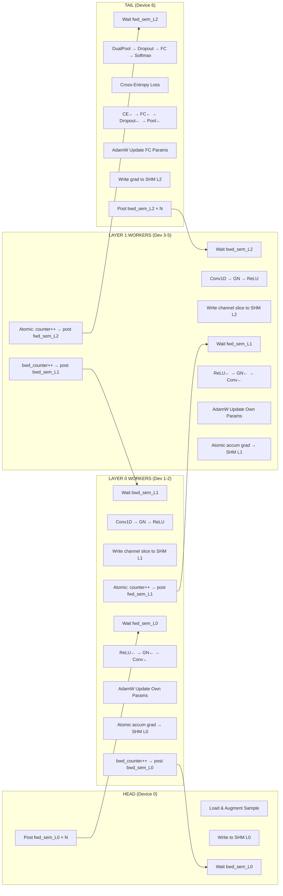
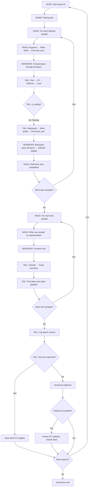
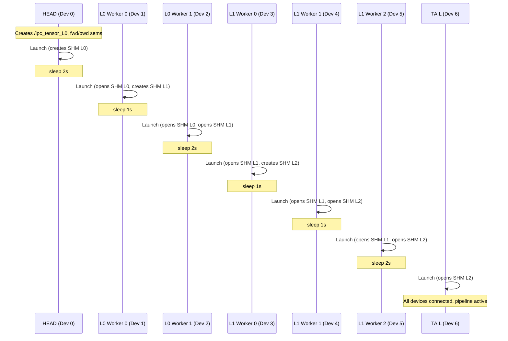

# PiLot Distributed

**Multi-device pipelined CNN training for time-series classification on nRF52840 clusters**

PiLot Distributed is the core implementation of the PiLot (Pipeline Lightweight on-device Training) framework. It partitions a 1D-CNN across multiple simulated nRF52840 devices, each running as a separate OS process. Devices communicate via POSIX shared memory and semaphores, forming a fully pipelined forward–backward training loop with per-sample gradient updates.

---

## Table of Contents

- [Overview](#overview)
- [Architecture](#architecture)
- [CNN Model](#cnn-model)
- [Device Roles](#device-roles)
- [Inter-Process Communication](#inter-process-communication)
- [Control Flow](#control-flow)
- [Project Structure](#project-structure)
- [Building](#building)
- [Running](#running)
- [Configuration](#configuration)
- [Training Features](#training-features)
- [Memory Model](#memory-model)
- [Supported Datasets](#supported-datasets)

---

## Overview

| Property | Value |
|---|---|
| **Target Hardware** | Nordic nRF52840 (ARM Cortex-M4F @ 64 MHz) |
| **RAM per Device** | 256 KB (weights, activations, gradients, optimizer state) |
| **Flash per Device** | 1 MB (dataset storage on head device) |
| **Default Device Count** | 7 (1 Head + 2 L0 Workers + 3 L1 Workers + 1 Tail) |
| **Language** | C11 |
| **Build System** | CMake 3.20+ |
| **IPC** | POSIX shared memory (`shm_open` / `mmap`) + named semaphores |
| **Dependencies** | `libm`, `pthread`, `librt` |

The distributed version demonstrates that on-device training of a CNN can be **partitioned across resource-constrained MCUs** using layer-wise parallelism, where each device holds only its own layer's parameters and optimizer state within the 256 KB RAM budget.

---

## Architecture

### 7-Device Pipeline Layout

```
┌─────────┐    ┌──────────────┐    ┌───────────────┐    ┌──────┐
│  HEAD   │───►│  LAYER 0     │───►│  LAYER 1      │───►│ TAIL │
│ Device 0│    │  2 Workers   │    │  3 Workers     │    │Dev 6 │
│         │    │ Dev 1, Dev 2 │    │ Dev 3,4,5      │    │      │
│ Dataset │◄───│ Conv1D 1→32  │◄───│ Conv1D 32→48   │◄───│ FC   │
│ Feeder  │    │ GN + ReLU    │    │ GN + ReLU      │    │Pool  │
└─────────┘    └──────────────┘    └───────────────┘    └──────┘
   Feed           16ch each           16ch each          Classify
   Samples        ──────────►         ──────────►        + Loss
   Augment        ◄──────────         ◄──────────        + Grads
                  Grad accum          Grad accum
```

Each worker in a layer is responsible for a **slice of output channels**:
- Layer 0: 2 workers × 16 channels = 32 total output channels
- Layer 1: 3 workers × 16 channels = 48 total output channels

---

## CNN Model

### Layer Details (Same as Centralized)

| Layer | Type | Config | Input Shape | Output Shape | Parameters |
|---|---|---|---|---|---|
| 0 | Conv1D | 1→32, k=5, s=1, p=2 | 1×300 | 32×300 | 192 |
| — | GroupNorm | 8 groups | 32×300 | 32×300 | 0 |
| — | LeakyReLU | α=0.01 | 32×300 | 32×300 | 0 |
| 1 | Conv1D | 32→48, k=5, s=2, p=2 | 32×300 | 48×150 | 7,728 |
| — | GroupNorm | 8 groups | 48×150 | 48×150 | 0 |
| — | LeakyReLU | α=0.01 | 48×150 | 48×150 | 0 |
| 2 | DualPool | GAP + GMP | 48×150 | 96×1 | 0 |
| 3 | Dropout | rate=0.2 | 96×1 | 96×1 | 0 |
| 4 | FC | 96→12 | 96×1 | 12×1 | 1,164 |
| 5 | Softmax | — | 12×1 | 12×1 | 0 |

**Total: 9,084 trainable parameters** distributed across 7 devices.

### Per-Device Parameter Distribution

| Device | Role | Parameters Held | RAM Estimate |
|---|---|---|---|
| Device 0 | Head | 0 (dataset in flash) | Dataset I/O only |
| Device 1 | L0 Worker 0 | 96 (Conv 1→16, k=5) | ~82 KB |
| Device 2 | L0 Worker 1 | 96 (Conv 1→16, k=5) | ~82 KB |
| Device 3 | L1 Worker 0 | 2,576 (Conv 32→16, k=5) | ~221 KB |
| Device 4 | L1 Worker 1 | 2,576 (Conv 32→16, k=5) | ~221 KB |
| Device 5 | L1 Worker 2 | 2,576 (Conv 32→16, k=5) | ~221 KB |
| Device 6 | Tail | 1,164 (FC 96→12) | ~34 KB |

Each worker's RAM includes: weights + bias + activations + gradient buffers + AdamW optimizer state (2× parameter count for m and v).

---

## Device Roles

### Head (Device 0) — Data Feeder

- Loads the UCR dataset from flash memory (plain `malloc`, not counted against RAM)
- Normalizes data (z-score per sample)
- Drives the training schedule: epoch loop → sample loop (train then test)
- Applies data augmentation during training (jitter, scaling, magnitude warp, time shift)
- Writes raw/augmented samples into Layer 0 shared memory
- Creates shared memory `/ipc_tensor_L0` and semaphores

### Workers (Devices 1–5) — Conv1D Processors

- Each worker computes its **slice** of the convolution (subset of output channels)
- Forward: Conv1D → GroupNorm → LeakyReLU on its channel slice
- Backward: ReLU backward → GroupNorm backward → Conv1D backward
- Atomically accumulates input gradients for the previous layer
- Updates its own parameters via AdamW with cosine annealing LR
- Worker 0 of each layer creates the next layer's shared memory segment

### Tail (Device 6) — Classifier

- Reads the concatenated output from all Layer 1 workers
- Applies Dual Pooling (GAP + GMP), Dropout, FC, Softmax
- Computes Cross-Entropy loss and backpropagates through the classifier
- Sends gradients back through the pipeline
- Tracks and reports training/test accuracy, loss, inference latency
- Implements early stopping (patience=50)

---

## Inter-Process Communication

### Shared Memory Layout

Each inter-layer link uses a POSIX shared memory region (`shm_open`):

```
┌──────────────────────────────────────────────────────┐
│                  ipc_layer_shm_t                     │
├──────────────────────────────────────────────────────┤
│ label         (int)   — ground-truth class label     │
│ counter       (int)   — atomic forward completion    │
│ bwd_counter   (int)   — atomic backward completion   │
│ channels      (int)   — tensor channel count         │
│ length        (int)   — tensor spatial length        │
│ sample_id     (int)   — current sample index         │
│ is_testing    (int)   — 0=training, 1=testing        │
├──────────────────────────────────────────────────────┤
│ buffer[0 .. N-1]      — forward activation data     │
│ buffer[N .. 2N-1]     — backward gradient data       │
└──────────────────────────────────────────────────────┘
   where N = channels × length
```

### Semaphore Protocol

Each link has two named POSIX semaphores:

| Semaphore | Direction | Purpose |
|---|---|---|
| `/ipc_sem_L{i}_fwd` | Forward | Signals that forward data is ready for consumers |
| `/ipc_sem_L{i}_bwd` | Backward | Signals that backward gradients are ready for producers |

**Forward flow**: The last worker to finish writing atomically increments `counter`. When `counter == num_workers`, it posts `fwd_sem` once per next-layer consumer, then resets the counter.

**Backward flow**: The last worker to finish accumulating gradients increments `bwd_counter`. When `bwd_counter == num_workers`, it posts `bwd_sem` once per previous-layer producer, then resets.

### Multi-Worker Gradient Accumulation

When multiple workers in a layer compute `grad_input` (gradients w.r.t. the shared input), they must atomically accumulate into the same buffer. This uses a **lock-free CAS (Compare-And-Swap) loop**:

```c
// Atomic float addition via CAS loop
do {
    old_val = *addr;
    new_val = old_val + grad_value;
} while (!__sync_bool_compare_and_swap((int*)addr, *(int*)&old_val, *(int*)&new_val));
```

---

## Control Flow

### Full Pipeline: Single Sample (Training)



### Epoch-Level Control Flow



### Device Startup & IPC Creation Order



**Critical ordering**: Each shared memory segment must be created before other devices try to open it. Worker 0 of each layer creates the next layer's segment. Launch delays ensure creation happens before open.

---

## Project Structure

```
PiLot_Distributed/
├── CMakeLists.txt                  # Build configuration
├── README.md                       # This file
├── configs/
│   ├── model_config.json           # Active configuration
│   ├── model_config_cricket_x.json # Dataset-specific configs
│   ├── model_config_ecg5000.json
│   └── ...                         # Multiple dataset × architecture configs
├── include/
│   ├── lw_pilot_sim.h              # Global sim: memory limits, device roles, proc delay
│   ├── nn_types.h                  # Tensor, Conv1D, FC, activation, optimizer API
│   ├── config_types.h              # Model config structs (with flash_memory_bytes)
│   ├── comm_types.h                # Message types, shared memory comm API
│   ├── ipc_tensor.h                # POSIX shm/sem tensor IPC primitives
│   ├── shared_memory.h             # SysV shared memory manager (legacy)
│   └── worker_threads.h            # Worker thread pool types
├── scripts/
│   └── test_distributed.sh         # Launch script for full pipeline
├── src/
│   ├── main.c                      # Entry point: CLI parsing, role dispatch
│   ├── shared_memory.c             # SysV shared memory implementation (legacy)
│   ├── devices/
│   │   ├── head_feeder.c           # HEAD: dataset loading, augmentation, sample injection
│   │   ├── worker_conv1.c          # WORKER: Conv1D + GN + ReLU + backward + AdamW
│   │   └── tail_classifier.c       # TAIL: pooling, FC, softmax, loss, early stopping
│   ├── nn/
│   │   ├── conv1d.c                # Conv1D forward & backward + GroupNorm
│   │   ├── fully_connected.c       # FC forward & backward
│   │   ├── activations.c           # LeakyReLU, Softmax, Dropout, Cross-Entropy
│   │   ├── pooling.c               # Dual Pooling (GAP+GMP) forward & backward
│   │   └── optimizers.c            # AdamW, Cosine Annealing LR, Gradient Clipping
│   ├── comm/
│   │   ├── ipc_tensor.c            # POSIX shm_open/mmap/sem_open implementation
│   │   └── shm_protocol.c          # Higher-level shared memory protocol
│   ├── data/
│   │   ├── ucr_loader.c            # UCR dataset loader (flash-aware, sim_malloc separation)
│   │   └── tensor.c                # Tensor utilities
│   ├── config/
│   │   └── config_loader.c         # JSON config parser
│   ├── threading/
│   │   └── worker_threads.c        # Thread pool for worker devices
│   └── utils/
│       └── logging.c               # Logging with level control
└── build/
    └── device                      # Compiled binary (single binary, role via CLI)
```

---

## Building

### Prerequisites

- GCC with C11 support
- CMake ≥ 3.20
- POSIX-compliant OS (Linux, WSL) for `shm_open`, `sem_open`, `mmap`

### Build Commands

```bash
cd PiLot_Distributed
mkdir -p build && cd build
cmake .. -DCMAKE_BUILD_TYPE=Release
make -j$(nproc)
```

The output binary is `build/device` — a single executable that runs as head, worker, or tail depending on CLI flags.

---

## Running

### Quick Start (Launch Script)

```bash
# From PiLot_Distributed/
bash scripts/test_distributed.sh
```

This launches all 7 devices with proper ordering and delay.

### Manual Launch (7-Device Pipeline)

Devices must be launched **in order** to respect shared memory creation dependencies:

```bash
BIN=./build/device
CFG=configs/model_config.json

# 1. Head — creates /ipc_tensor_L0
$BIN --config=$CFG --id=0 --role=head --dataset=Cricket_X &
sleep 2

# 2. Layer 0, Worker 0 — opens L0, creates L1
$BIN --config=$CFG --id=1 --role=worker --layer-id=0 --worker-id=0 --num-workers=2 &
sleep 1

# 3. Layer 0, Worker 1 — opens L0, opens L1
$BIN --config=$CFG --id=2 --role=worker --layer-id=0 --worker-id=1 --num-workers=2 &
sleep 2

# 4. Layer 1, Worker 0 — opens L1, creates L2
$BIN --config=$CFG --id=3 --role=worker --layer-id=1 --worker-id=0 --num-workers=3 &
sleep 1

# 5. Layer 1, Worker 1 — opens L1, opens L2
$BIN --config=$CFG --id=4 --role=worker --layer-id=1 --worker-id=1 --num-workers=3 &
sleep 1

# 6. Layer 1, Worker 2 — opens L1, opens L2
$BIN --config=$CFG --id=5 --role=worker --layer-id=1 --worker-id=2 --num-workers=3 &
sleep 2

# 7. Tail — opens L2
$BIN --config=$CFG --id=6 --role=tail --classes=12 &

wait
```

### CLI Reference

| Flag | Description | Used By |
|---|---|---|
| `--config=<path>` | Path to JSON config file | All |
| `--id=<N>` | Device ID (0–6) | All |
| `--role=<head\|worker\|tail>` | Device role | All |
| `--dataset=<name>` | UCR dataset name | Head |
| `--classes=<N>` | Number of output classes | Tail |
| `--layer-id=<N>` | Conv layer index (0, 1) | Worker |
| `--worker-id=<N>` | Worker index within layer (0-based) | Worker |
| `--num-workers=<N>` | Total workers in this layer | Worker |
| `--mem-limit=<bytes>` | Override RAM limit | All |
| `--debug` | Enable verbose logging | All |
| `-p` | Enable processing delay simulation (64 MHz) | All |

### Environment Variable

| Variable | Description | Default |
|---|---|---|
| `UCR_DATA_ROOT` | Root directory of UCR datasets | `/mnt/d/New folder/UCR_DATASETS` |

---

## Configuration

Generated by the shared `generate_config.py` script:

```bash
cd PiLot/
python3 generate_config.py --dataset=Cricket_X --epochs=50
```

### Distributed Config Structure

```json
{
  "model": { "name": "nRF52840_UniformCNN_Cricket_X", "version": "2.0" },
  "global": {
    "dataset": "Cricket_X",
    "epochs": 50,
    "num_classes": 12,
    "input_length": 300,
    "memory_limit_bytes": 262144,
    "flash_memory_bytes": 1048576,
    "learning_rate": 0.01
  },
  "layers": [
    {
      "id": 0, "type": "conv1d",
      "in_channels": 1, "out_channels": 32,
      "kernel_size": 5, "stride": 1, "padding": 2,
      "num_devices": 2,
      "channels_per_device": 16,
      "input_length": 300, "output_length": 300,
      "memory_per_device_bytes": 82096,
      "ops_per_device": 81600
    },
    {
      "id": 1, "type": "conv1d",
      "in_channels": 32, "out_channels": 48,
      "kernel_size": 5, "stride": 2, "padding": 2,
      "num_devices": 3,
      "channels_per_device": 16,
      "input_length": 300, "output_length": 150,
      "memory_per_device_bytes": 221184,
      "ops_per_device": 784800
    },
    {
      "id": 2, "type": "fc",
      "in_features": 96, "out_features": 12,
      "num_devices": 1,
      "memory_per_device_bytes": 34272,
      "ops_per_device": 2304
    }
  ]
}
```

Key differences from centralized config:
- `memory_limit_bytes` = 262144 (256 KB — enforced via `sim_malloc`)
- `flash_memory_bytes` = 1048576 (1 MB — for dataset storage)
- Each layer has `num_devices`, `channels_per_device`, `memory_per_device_bytes`, `ops_per_device`

---

## Training Features

### Optimizer: AdamW (Per-Device)

Each device independently maintains AdamW state for its own parameters:

- **β₁** = 0.9, **β₂** = 0.999, **ε** = 1e-8
- **Weight decay** = 0.0003 (decoupled)
- Bias updated **without** weight decay
- Adam timestep tracked per-device

### Learning Rate Schedule: Cosine Annealing

- Epoch detection via `is_testing` flag transitions in shared memory
- **Warmup**: 3 epochs linear ramp
- **Cosine**: T_max = 60, η_min = 1e-5
- Same schedule on all devices (synchronized via shared epoch counter)

### Gradient Clipping

- L2-norm clipping at `max_norm = 5.0`
- Applied on each device to its own parameter gradients before the AdamW step

### Early Stopping (Tail Only)

- **Patience** = 50 epochs
- Tail tracks test accuracy and saves best FC weights
- On trigger: FC weight updates frozen, but gradients still propagated so conv workers continue adapting

### Data Augmentation (Head Only, Training)

| Transform | Probability | Parameters |
|---|---|---|
| Jitter | 100% | Gaussian noise, σ = 0.03 |
| Scaling | 70% | Uniform factor in [0.85, 1.15] |
| Magnitude Warp | 50% | 4-knot spline, σ = 0.15 |
| Time Shift | 30% | Circular shift, max ± 10 steps |

### Processing Delay Simulation

With the `-p` flag, each device simulates Cortex-M4F execution time:

```
delay = FLOPs / 64,000,000 Hz
```

Forward pass uses the actual convolution FLOP count; backward pass uses 4× forward FLOPs.

---

## Memory Model

### RAM vs Flash Separation

The nRF52840 has 256 KB RAM and 1 MB flash. PiLot enforces this at the simulation level:

| Memory Type | Allocation API | Budget | Contents |
|---|---|---|---|
| **RAM** | `sim_malloc()` | 256 KB | Conv weights, bias, activations, gradients, optimizer state |
| **Flash** | `malloc()` | 1 MB | Dataset samples and labels (head device only) |

`sim_malloc()` is a tracking allocator that enforces the 256 KB limit and reports peak usage. Exceeding the limit causes the device to abort with an error.

### Per-Device RAM Breakdown (Layer 1 Worker)

```
Conv weights: 32 × 16 × 5 × 4 bytes          =  10,240 B
Conv bias:    16 × 4 bytes                     =      64 B
Adam m_w:     10,240 B
Adam v_w:     10,240 B
Adam m_b:         64 B
Adam v_b:         64 B
Grad weights: 10,240 B
Grad bias:        64 B
─────────────────────────────────────────────────
Subtotal (params + optimizer):                   41,216 B

Forward tensors (input + conv_out + gn + relu):  ~76,800 B
Backward tensors (4 gradient buffers):           ~76,800 B
GroupNorm intermediates:                         ~19,200 B
─────────────────────────────────────────────────
Total estimated:                                ~214,016 B (fits in 256 KB)
```

---

## Supported Datasets

The system supports 27 UCR Time Series Archive datasets. Generate configs for any:

```bash
python3 generate_config.py --dataset=ECG5000 --epochs=100
python3 generate_config.py --list-datasets   # Show all supported
```

| Dataset | Length | Classes | | Dataset | Length | Classes |
|---|---|---|---|---|---|---|
| Coffee | 286 | 2 | | GunPoint | 150 | 2 |
| ECG5000 | 140 | 5 | | FaceAll | 131 | 14 |
| Cricket_X | 300 | 12 | | Wafer | 152 | 2 |
| ElectricDevices | 96 | 7 | | StarLightCurves | 1024 | 3 |
| FordA | 500 | 2 | | TwoPatterns | 128 | 4 |

---

## Example Output

### Head Device
```
[INFO] Starting Head Device 0 (Data Feeder)
[INFO] RAM limit: 262144 bytes (256 KB) per device
[INFO] Flash memory: 1048576 bytes (1024 KB) per device
[INFO] Dataset stored in flash: 457 KB (data) + 2 KB (labels)
[INFO] Loaded 390 train + 390 test samples (Cricket_X)
[INFO] Created shared memory /ipc_tensor_L0 (size 2408)
[INFO] Head: Starting epoch 1 (390 train + 390 test samples)
```

### Tail Device (Epoch Summary)
```
[INFO] ════════════════════════════════════════════════════
[INFO] EPOCH 49 COMPLETE
[INFO]   Train Accuracy: 57.69% (225/390)
[INFO]   Test  Accuracy: 61.79% (241/390)
[INFO]   Avg Test Loss:  1.3842
[INFO]   Avg Inference:  0.042 ms
[INFO]   Elapsed:        89.3s
[INFO]   RSS Memory:     4284 KB
[INFO]   ** New best: 61.79% at epoch 49
[INFO] ════════════════════════════════════════════════════
```

---

## Known Limitations

1. **Pipeline drain at termination**: When the head finishes all epochs and exits, the tail may hang waiting for one more `fwd_sem` post. Use `kill` or Ctrl+C to terminate remaining processes.

2. **Launch ordering**: Devices must start in the correct order with delays to ensure shared memory creation precedes open. The launch script handles this automatically.

3. **No checkpoint persistence**: Best weights are kept in-memory during training but not saved to disk. Restarting requires re-training.

4. **Single-sample pipeline**: The pipeline processes one sample at a time (no mini-batching across the pipeline). This maximizes memory efficiency but means pipeline throughput is limited by the slowest device.
